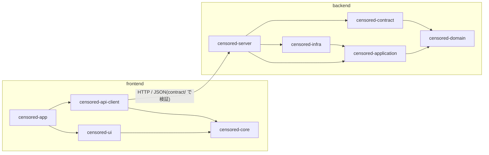

# アーキテクチャ概要

全体の地図を置く。判断の理由は [ADR](../adr/README.md)、パッケージの構成は [ディレクトリ構成](../conventions/01-directory-structure.md) が正本。

```mermaid
flowchart LR
  subgraph frontend
    app[censored-app] --> ui[censored-ui]
    app --> client[censored-api-client]
    ui --> fcore[censored-core]
    client --> fcore
  end
  subgraph backend
    server[censored-server] --> infra[censored-infra]
    server --> contract[censored-contract]
    server --> application[censored-application]
    infra --> application
    application --> domain[censored-domain]
    contract --> domain
  end
  client -- "HTTP / JSON(contract/ で検証)" --> server
```

データストア、配信方式、デプロイ構成は未決定。決定したら ADR を書き、ここに反映する。
